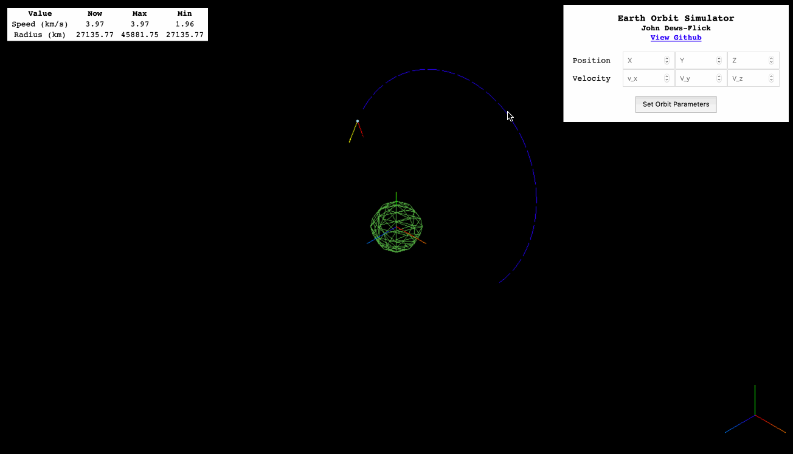

# Orbit Simulator
Two body orbit simulator for Earth, using an Earth-centered inertial [(ECI)](https://en.wikipedia.org/wiki/Earth-centered_inertial) coordinate system

## Demo

## Todo
- Customize G in UI
- Customize planet radius in UI
- Give e, a, p readout
- Mark Apoapsis and Periapsis 

